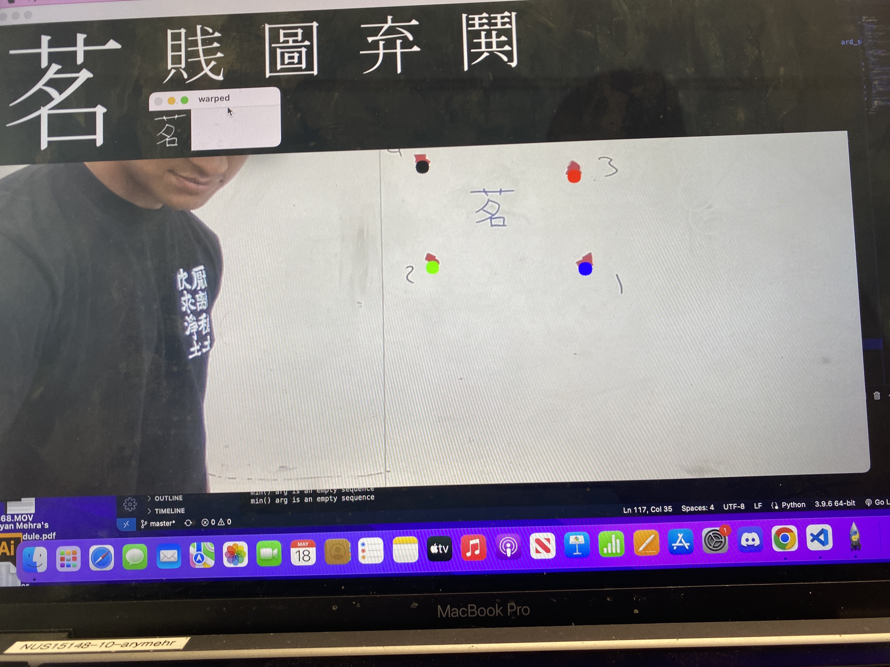

# Handwritten OCR for Kanji Characters

Open-source research project developing a CNN OCR (optical character recognition) model that can identify handwritten Kanji and other Japanese characters.




## Procedure

The [dataset](https://github.com/KanjiVG/kanjivg/releases) used in the project consists of 7,000 images of handwritten kanji characters with one sample each which are 64x64.

## 🚀 Getting Started

```sh
git clone https://github.com/Jdka1/Kanji-Recognition.git
cd Kanji-Recognition
```

## 🤝 Contributing

If you have ideas for improvements please feel free to submit a pull request, any changes are welcome!

## 📜 License

The **Kanji-Recognition** project is open-source and is licensed under the [MIT License](https://github.com/Jdka1/Kanji-Recognition/blob/main/LICENSE).
